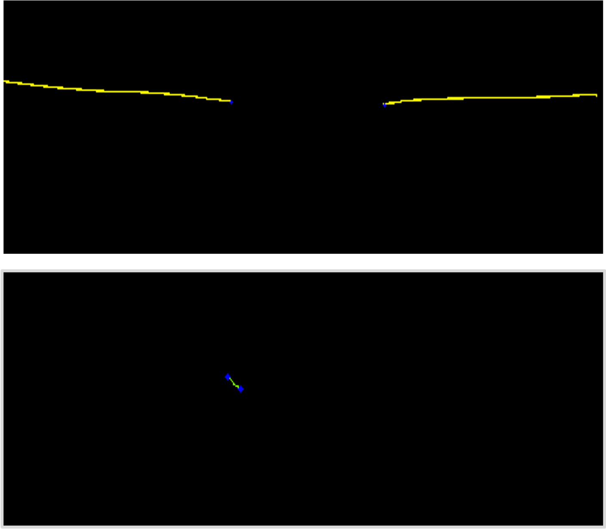

# EDI_OCT_corner_detection

This repository contains the code for **Enhanced depth imaging in spectral-domain optical coherence tomography (EDI SD-OCT)** corner detection. It is based on the paper [Good features to track](https://ieeexplore.ieee.org/abstract/document/323794) by **Jianbo Shi and Carlo Tomasi**. The repository is used to detect the corners of the layers of the retina in the EDI SD-OCT images. The code is written in Python and uses the OpenCV library. To use the code, you need to have the EDI SD-OCT images.

## Usage

To clean the code, use the following command:

```bash
python data_preparation.py
```

To extract the pixels from label that contains information of the layers of the retina, use the following command:

```bash
python pixel_extraction.py
```

To detect the corners of the layers of the retina, use the following command:

```bash
python corner_detection.py
```

To save the coordinates of the detected corners, use the following command:

```bash
python coordnates.py
```

## Results

The results of the Shi-Tomasi corner detection are shown in the following figure:


## Contributing

Pull requests are welcome. For major changes, please open an issue first to discuss what you would like to change.

Please make sure to update tests as appropriate.
